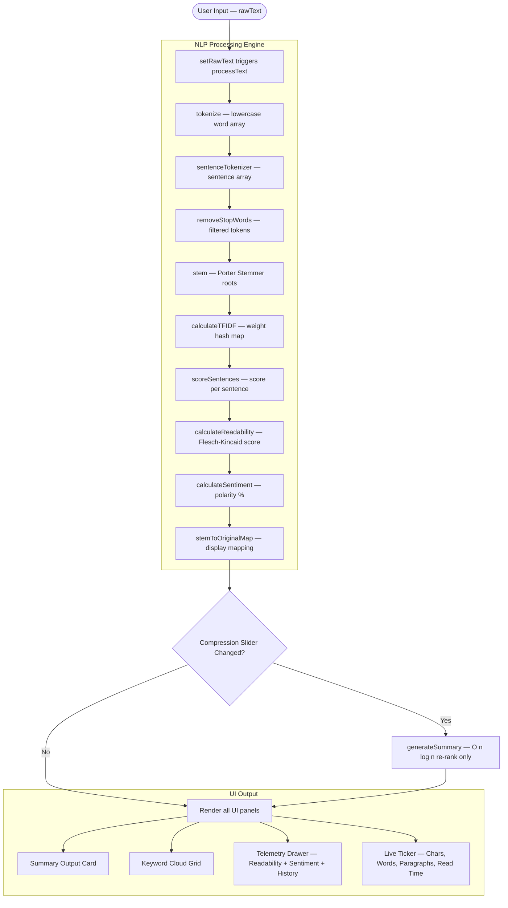

# Smart Text Summarizer & Keyword Weight Calculator

**Live Demo:** [Live Web Application](https://nexustext.vercel.app/)

---

**Case Study No. 116** | B.Tech CSE 2025–29, Semester II | ITM Skills University
**Developed by:** Daksh Srivastava

---

## Overview

This application is a high-performance, privacy-first analytical dashboard that transforms unstructured text into deeply indexed, mathematical data models. It operates as a purely in-memory processing engine — ingesting raw text, running it through a multi-stage tokenization and filtering pipeline, and producing rich statistical outputs including extractive summaries, weighted keyword matrices, readability gauges, and sentiment polarity analysis.

The entire processing engine is built with deterministic algorithms and runs at near-instantaneous speeds using modern client-side JavaScript. No text is ever transmitted to a server; everything from tokenization to TF-IDF scoring happens locally in the browser tab.

---

## Problem Statement

Build a frontend-only ReactJS web application that performs real-time Natural Language Processing (NLP) entirely inside the user's browser. The system must implement deterministic string tokenization, TF-IDF keyword weighting, extractive sentence ranking, Flesch-Kincaid readability scoring, and lexical sentiment analysis — all without any backend server or external API. User data must never leave the client machine, ensuring absolute privacy.

---

## Screenshots

### Landing Page


### Split Workspace Layout


### Real-Time Live Ticker


### Interactive Compression Slider


### Keyword Output Quantity Slider


### Cross-Component Keyword Highlighting


### Telemetry Drawer


### Snapshot DB


### LocalStorage History Sync


---

## Features

### Core NLP Engine

- **Tokenization Pipeline** — Splits documents into lowercase word arrays using Regular Expressions (`RegExp`), then filters them through a hardcoded static stop-words array of 150+ common English words embedded directly in source code.
- **Porter Stemming Algorithm** — A full 5-step implementation of the classic Porter Stemmer that reduces inflected words to their root stems (e.g., *running* → *run*, *generalization* → *general*, *cats* → *cat*), enabling accurate term grouping across morphological variants.
- **TF-IDF Keyword Weight Calculator** — Implements the standard Term Frequency–Inverse Document Frequency mathematical model. Words with high frequency that are meaningfully clustered across sentences receive the heaviest analytical weight.
- **Extractive Sentence Ranking** — Scores every sentence by summing the TF-IDF weights of its unique keywords, sorts them by score in descending order, and extracts the top X% (user-controlled via an interactive slider) to assemble a coherent, naturally ordered summary.
- **Flesch-Kincaid Readability Score** — Calculates reading ease using the standard formula, powered by a custom syllable counter that handles silent-e rules and vowel cluster detection.
- **Lexical Sentiment Analysis** — Compares filtered tokens against a static local dictionary of 200+ positive and 150+ negative emotional words to compute an overall sentiment polarity percentage.

### Dashboard & UI

- **Skeuomorphic Design Language** — A premium, tactile interface inspired by physical analytical hardware, featuring recessed LCD-style screens, mechanical push-buttons with 3D depth shadows, and matte textured backgrounds.
- **Landing Page** — A hero entry screen with feature cards explaining TF-IDF, Privacy, and Telemetry capabilities, and a prominent call-to-action button.
- **Split Workspace Layout** — A responsive two-column grid: the left column houses the Data Ingestion editor, the right column contains the Analytical Insights dashboard.
- **Real-Time Live Ticker** — Instantly tracks character count, word count, paragraph count, and estimated reading time (at 200 WPM) as the user types.
- **Interactive Compression Slider** — Allows real-time control of summary density from 5% to 100% without re-processing the entire text (only re-ranks cached sentence scores).
- **Keyword Output Quantity Slider** — A dedicated toggle slider (5–40 keywords, step 5) that controls the maximum number of keywords displayed in the tag-cloud matrix.
- **Cross-Component Keyword Highlighting** — Clicking any keyword badge instantly swaps the textarea for a rich DOM-based display that wraps every matching occurrence in amber `<mark>` tags and auto-scrolls to the first hit.
- **Telemetry Drawer** — A slide-in side panel featuring a Recharts-powered radial gauge for the Readability Index, a stacked polarity bar for Emotional Sentiment distribution, a Complexity Profiler, and a Snapshot DB for saving and restoring analysis history.

### Data Persistence

- **LocalStorage History Sync** — Users can save named analysis snapshots (including raw text, summary, and compression settings) directly to the browser's `localStorage` via Zustand's `persist` middleware. Snapshots survive page reloads and can be restored or deleted at any time.

---

## Tech Stack

| Layer | Technology | Version | Purpose |
|---|---|---|---|
| Framework | React | ^19.x | Component-based UI rendering |
| Build Tool | Vite | ^8.x | Lightning-fast HMR and optimized production builds |
| State Management | Zustand + `persist` middleware | ^5.x | Centralized reactive store with localStorage sync |
| Styling | Tailwind CSS v4 (`@tailwindcss/vite`) | ^4.x | Utility-first CSS with skeuomorphic custom shadows |
| Charting | Recharts | ^3.x | Radial bar gauge for readability visualization |
| Icons | Lucide React | ^1.x | Consistent, lightweight SVG icon library |

---

## Architecture & Data Flow

### Data Flow Pipeline



### Project Structure

```
smart-text-summarizer/
├── index.html                          # Entry HTML with Google Fonts (Inter)
├── vite.config.js                      # Vite + Tailwind CSS plugin config
├── package.json                        # Dependencies and scripts
├── README.md                           # This file
└── src/
    ├── main.jsx                        # React DOM mount point
    ├── index.css                       # Tailwind directives + global styles
    ├── App.jsx                         # Landing page + dashboard layout + routing
    ├── store/
    │   └── useTextStore.js             # Zustand store (state, actions, history, samples)
    ├── utils/
    │   ├── textProcessing.js           # Core NLP engine (tokenize, TF-IDF, summarize, readability, sentiment)
    │   ├── porterStemmer.js            # Full Porter Stemmer algorithm (5 steps)
    │   ├── stopWords.js                # Static hardcoded stop-words array (150+ words)
    │   ├── syllableCounter.js          # Syllable counting utility for Flesch-Kincaid
    │   └── sentimentDicts.js           # Static positive/negative word dictionaries (350+ words)
    └── components/
        ├── RawInputEditor.jsx          # Textarea + sample loader + clear button + live ticker
        ├── RawTextDisplay.jsx          # DOM-based keyword highlighting with auto-scroll
        ├── AnalyticsDashboard.jsx      # Container for Summary + Keyword panels
        ├── SummaryOutputCard.jsx       # Extractive summary display + compression slider
        ├── KeywordCloudGrid.jsx        # TF-IDF tag-cloud matrix + keyword limit slider
        └── TelemetryPanel.jsx          # Readability gauge + sentiment bar + complexity + history
```

### Performance Design Decisions

1. **Decoupled Summary Generation** — Changing the compression slider does NOT re-run the full tokenization pipeline. It only calls `generateSummary()` on the cached `sentenceScores[]`, making slider adjustments sub-millisecond.
2. **Selective Re-rendering** — Each component subscribes to only the specific Zustand slices it needs, minimizing unnecessary React re-renders.
3. **Memoized Metrics** — The live ticker calculations (chars, words, paragraphs, reading time) are wrapped in `useMemo` and only recompute when `rawText` actually changes.
4. **Stem-to-Original Mapping** — During tokenization, the engine tracks the most frequently occurring original word for each stemmed root, so the UI displays human-readable words instead of raw stems.

---

## Mathematical Models

### Term Frequency (TF)

$$\text{TF}(t, s) = \frac{\text{count}(t \text{ in sentence } s)}{|\text{words in sentence } s|}$$

### Inverse Document Frequency (IDF)

$$\text{IDF}(t) = \log\left(\frac{N}{\text{df}(t)}\right)$$

Where:
* $N$ is the total number of sentences in the document.
* $\text{df}(t)$ is the number of sentences containing the term $t$.

### TF-IDF Weight

$$W(t) = \frac{\sum_{s} \left[\text{TF}(t, s) \times \text{IDF}(t)\right]}{N}$$

*(Averaged across all sentences)*

### Sentence Score

$$\text{Score}(s) = \sum_{t \in s} W(t)$$

*(Sum of weights $W(t)$ for each unique stemmed term $t$ in sentence $s$)*

### Flesch-Kincaid Reading Ease

$$\text{FK} = 206.835 - 1.015 \times \left(\frac{\text{words}}{\text{sentences}}\right) - 84.6 \times \left(\frac{\text{syllables}}{\text{words}}\right)$$

*(Clamped to the range $[0, 100]$)*

### Sentiment Polarity

$$\text{Positive \%} = \frac{\text{positiveHits}}{\text{positiveHits} + \text{negativeHits}} \times 100$$

$$\text{Negative \%} = 100 - \text{Positive \%}$$

---

## Installation & Setup

### Prerequisites

- **Node.js** v18 or higher
- **npm** v9 or higher

### Steps

```bash
# 1. Clone the repository
git clone https://github.com/Daksh-create349/React-smart-text-summarizer.git

# 2. Navigate into the project directory
cd React-smart-text-summarizer

# 3. Install dependencies
npm install

# 4. Start the development server
npm run dev
```

The application will be available at `http://localhost:5173/`.

### Production Build

```bash
# Build optimized static assets
npm run build

# Preview the production build locally
npm run preview
```

The production bundle is output to the `dist/` directory and can be deployed to any static hosting provider (Vercel, Netlify, GitHub Pages, etc.).

---

## How to Use

1. **Launch** — Open the application and click the **"Engage System"** button on the landing page.
2. **Ingest Text** — Paste your own long-form text into the editor, or click **"Load Sample Data"** to select one of three pre-loaded articles (AI/Technology, Health/Mediterranean Diet, Global Finance).
3. **Read the Summary** — The right panel instantly generates an extractive summary. Use the **Density slider** (5%–100%) to control how many sentences are included.
4. **Explore Keywords** — The Keyword Matrix shows the top TF-IDF–weighted terms as interactive badges. Use the **Limit slider** (5–40) to control how many appear.
5. **Highlight Occurrences** — Click any keyword badge to highlight every occurrence of that word and its morphological variants directly in the raw text with amber markers.
6. **Open Telemetry** — Click the **"Telemetry Panel"** button in the header to open the side drawer containing the Readability Index gauge, Emotional Polarity bar, and Complexity Profiler.
7. **Save Snapshots** — Inside the Telemetry Panel, click **"Commit"** to save the current analysis to localStorage. You can **Restore** or **Delete** any saved snapshot at any time.

---

## Sample Articles Included

| # | Topic | Word Count | Description |
|---|---|---|---|
| 1 | Artificial Intelligence | ~300 | Covers AI evolution, deep learning, ethical concerns, and XAI |
| 2 | Mediterranean Diet | ~300 | Explores cardiovascular benefits, cognitive health, and lifestyle |
| 3 | Global Finance | ~300 | Discusses coordinated central bank monetary policy and market impact |

---

## Privacy & Security

- **Zero Network Requests** — The application makes absolutely no HTTP calls, API requests, or WebSocket connections. All processing happens in the browser's JavaScript engine.
- **No Tracking** — No analytics, telemetry, cookies, or fingerprinting of any kind.
- **LocalStorage Only** — The only persistent data is the user's voluntarily saved history snapshots, stored in the browser's `localStorage` and fully deletable.

---

## Dependencies

| Package | Version | Purpose |
|---|---|---|
| `react` | ^19.x | UI framework |
| `react-dom` | ^19.x | DOM rendering |
| `zustand` | ^5.x | Lightweight state management with persistence |
| `recharts` | ^3.x | Data visualization (radial gauge) |
| `lucide-react` | ^1.x | SVG icon components |
| `@tailwindcss/vite` | ^4.x | Tailwind CSS build plugin |
| `tailwindcss` | ^4.x | Utility-first CSS framework |
| `vite` | ^8.x | Build tool and dev server |

---

## Author

**Daksh Srivastava**
B.Tech Computer Science & Engineering, 2025–29
ITM Skills University

---

## License

This project was developed as an academic case study submission. All rights reserved.
